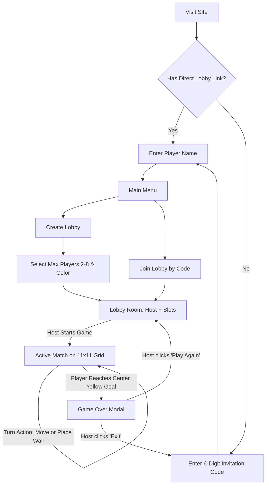

# WallRush Multiplayer Game Implementation Plan (Vercel Serverless)

A realtime multiplayer board game inspired by "WallRush", built with **HTML5, Vanilla CSS, JavaScript**, and **Supabase Realtime (Broadcast & Presence)**, optimized for **100% Free Vercel Deployment (No Credit Card Required)**. Players navigate an **11x11 grid** toward a glowing center yellow goal `(5, 5)` while moving orthogonally or placing walls to obstruct opponents without completely blocking paths to the goal.

---

## Architecture & Vercel Serverless Deployment

> [!IMPORTANT]
> **Vercel Serverless + Supabase Realtime Architecture**:
> - **Zero Server Maintenance & $0 Cost**: The application frontend (HTML5/CSS/JS) is deployed on **Vercel** with global CDN caching and zero cold-starts.
> - **Card-Free Realtime WebSockets**: Uses **Supabase Realtime (Broadcast & Presence)** for live player movement, wall placements, and lobby sync without running a paid or persistent backend server.
> - **Client-Side BFS Pathfinding**: BFS path verification runs directly in JavaScript (`js/pathfinding.js`) to reject wall placements that seal off any player from reaching `(5, 5)`.

---

## User Review Required

> [!NOTE]
> **Key Architecture Decisions**:
> 1. **Vercel + Supabase Realtime**: Replaces Django Channels/Daphne to allow 100% free hosting on Vercel without requiring a credit card or a paid server process.
> 2. **Client-Side Validation & Broadcast**: Game actions (marble movements, wall placements, rotation) are validated locally via JS and broadcast instantly to all connected players in the same room.

---

## Rich Visuals & Smooth Animations

To deliver a polished and engaging visual aesthetic matching the design:
1. **Screen Transitions**:
   - Silky smooth fade and translateY slide between screens (Invitation Code &rarr; Name &rarr; Main Menu &rarr; Lobby &rarr; Game &rarr; Victory Modal).
2. **Board & Glow Effects**:
   - Multi-color neon perimeter border (green, purple, blue, amber) with subtle ambient breathing glow across the **11x11 grid**.
   - Center yellow goal cell `(5, 5)` with radiant pulsing aura and golden bezel.
3. **Player Marbles (3D Spheres)**:
   - Glossy radial gradient with 3D specular highlight and dynamic drop-shadow.
   - **Smooth Move Animation**: Marble glides across grid cells with `cubic-bezier(0.34, 1.56, 0.64, 1)` bounce-easing.
4. **Wall Placement & Rotation**:
   - **Interactive Preview**: Ghost wall follows the cursor along grid edges.
   - **Rotation Transition**: Smooth 90-degree rotational flip when pressing `R` (clockwise) or `E` (counter-clockwise).
   - **Placement Pop**: Newly placed wall animates in with a scale-pop (`scale(0.8) -> scale(1.05) -> scale(1)`) and soft shadow expansion.
5. **Lobby & Turn Micro-Animations**:
   - Empty slots display `Waiting for player...` with wave animations.
   - Lively pulse effect on turn banner when it becomes your turn.
   - Invalid move / blocked wall placement triggers an intuitive shake effect with a tooltip ("Path to goal must stay open!").
6. **Victory Celebration**:
   - Lightweight canvas particle confetti burst and victory medal glow upon stepping on the center goal.

---

## User Flow & Core Rules

1. **6-Digit Invitation Code Screen**:
   - Master access code (default `784921`, configurable in client JS).
   - Automatically bypassed if joining via direct invite link (`?join=AdV2d4`).
2. **Player Profile**:
   - Name input + marble color selector.
3. **Lobby Creation & Joining**:
   - Max players: 2, 3, 4, 5, 6, 7, 8.
   - Generates 6-character room code (e.g. `AdV2d4`) with 1-click shareable link (`https://your-game.vercel.app/?join=AdV2d4`).
4. **Waiting Room**:
   - Host badge: `Me (Host)`.
   - Connected players displayed with marble spheres using Supabase Presence.
   - Empty slots: `Waiting for player...` with wave animations.
   - Host clicks "Start Game" when ready (&ge; 2 players).
5. **Game Rules & Mechanics**:
   - **11x11 grid**: Yellow goal is at center `(5, 5)`.
   - **Starting Setup**: Players spawn on outer border cells. Starting player and turn rotation direction (clockwise / counter-clockwise) are randomized.
   - **Turn Action**: Choose either:
     1. **Move**: 1 cell orthogonally (Up, Down, Left, Right). Cannot cross walls.
     2. **Place Wall**: 2 grid cells long. Rotate with `R` (clockwise) or `E` (counter-clockwise).
   - **BFS Path Validation**: Walls cannot completely seal off any player from reaching `(5, 5)`. Any placement that blocks a player is rejected with a shake animation.
6. **Victory & Replay**:
   - Winner sees: "You won!"
   - Others see: "[Winner Name] won! Wait for the host to play again..."
   - Host options: "Play again" (resets game state instantly in the same room) or "Exit" (closes lobby and returns to invitation screen).

---

## Proposed File Structure & Changes

### Frontend App (Vercel Ready)
#### [NEW] [index.html](file:///c:/Users/Elmer/Desktop/walltowall/index.html)
- Clean, semantic single-page layout containing Invitation, Name Input, Main Menu, Lobby, 11x11 Board, and Victory Modal.

#### [NEW] [css/style.css](file:///c:/Users/Elmer/Desktop/walltowall/css/style.css)
- Glassmorphism UI tokens, glowing multi-color borders, 3D marble gradients, pill walls, and keyframe animations.

#### [NEW] [js/supabase-config.js](file:///c:/Users/Elmer/Desktop/walltowall/js/supabase-config.js)
- Supabase client initialization (using CDN script) connecting to Supabase Realtime broadcast channels.

#### [NEW] [js/pathfinding.js](file:///c:/Users/Elmer/Desktop/walltowall/js/pathfinding.js)
- Client-side BFS algorithm verifying that all active players maintain a valid open path to goal `(5, 5)` on the 11x11 grid.

#### [NEW] [js/game.js](file:///c:/Users/Elmer/Desktop/walltowall/js/game.js)
- Complete game controller: Supabase room presence, turn sync, smooth marble gliding, interactive wall previews (`R`/`E`), wall placements, confetti effects, and invite link parser.

#### [NEW] [vercel.json](file:///c:/Users/Elmer/Desktop/walltowall/vercel.json)
- Vercel project configuration serving static assets with clean routing.

---

## Verification Plan

### Automated Tests
- JavaScript unit tests for `pathfinding.js` validating open paths vs completely blocked wall scenarios on an 11x11 grid.

### Manual Verification
- Deploy to Vercel (or preview locally) without credit card required.
- Verify Invitation Code screen and link bypass (`?join=XXXXXX`).
- Open 2 or more browser tabs to test realtime lobby presence, player join sync, turn rotation, marble movement glide, wall rotation (`R`/`E`), BFS block rejection, and win modal replay.
